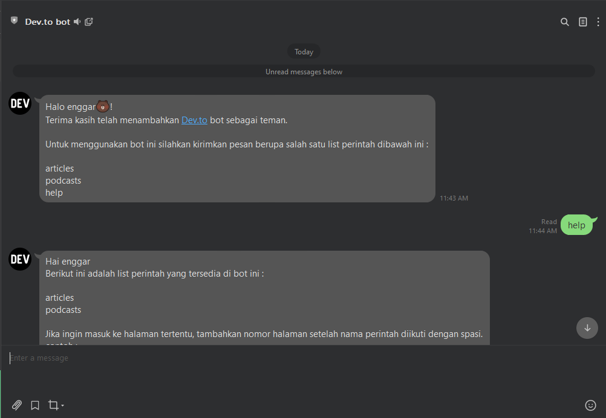
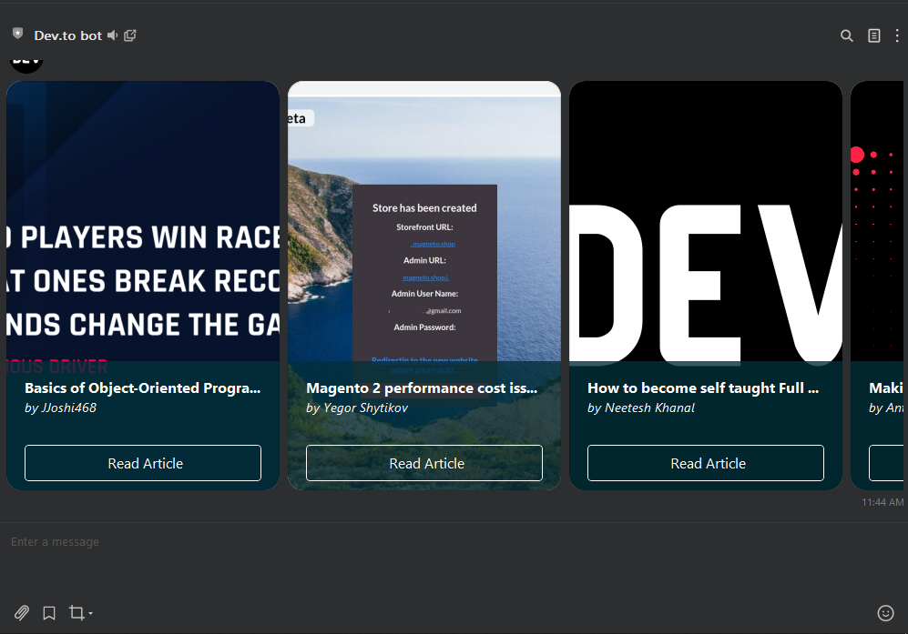
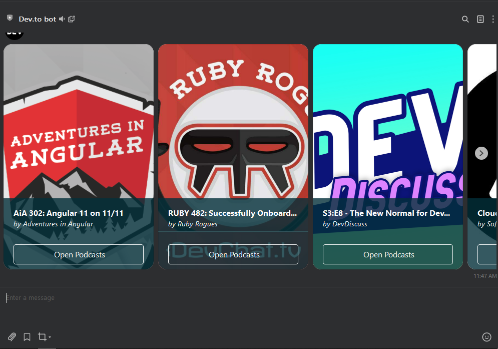
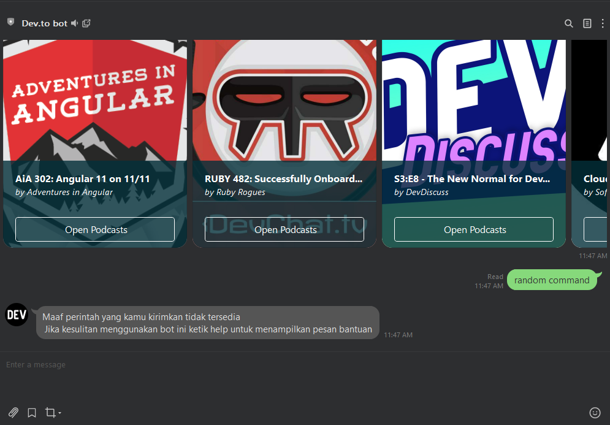

## Dev.to Line bot

Repository untuk backend line bot.

## Fitur

- [x] Mengambil list artikel dari dev.to
- [x] Mengambil list podcasts dari dev.to

## List command 

```
articles :page: = Mengambil list artikel (default halaman = 0)
podcasts :page: = Mengambil list podcast (default halaman = 0) 
help            = Menampilkan pesan bantuan
```

## Penggunaan
1. Silahkan tambahkan akun dari bot ini sebagai teman : [@873pbazo](https://lin.ee/bGXyJad) atau bisa juga dengan scan QR code dibawah  


2. Jika sudah silahkan kirimkan pesan sesuai command yang tersedia.   
contoh : 

```
articles 1
```

Maka bot akan mengambil list artikel halaman 1 dari api milik dev.to. Jika halaman tidak diinputkan maka secara otomatis bot akan mengambil dari halaman 0 / pertama.

## Dibuat dengan
- [x] Lumen
- [x] Line PHP SDK

## Screenshoot

- Pesan yang ditampilkan ketika bot pertama kali ditambahkan sebagai teman & tampilan pesan help


- Tampilan ketika menjalankan perintah articles


- Tampilan ketika menjalankan perintah podcasts


- Tampilan ketik perintah yang diinputkan tidak tersedia di dalam list

